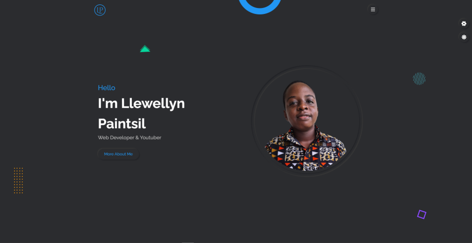
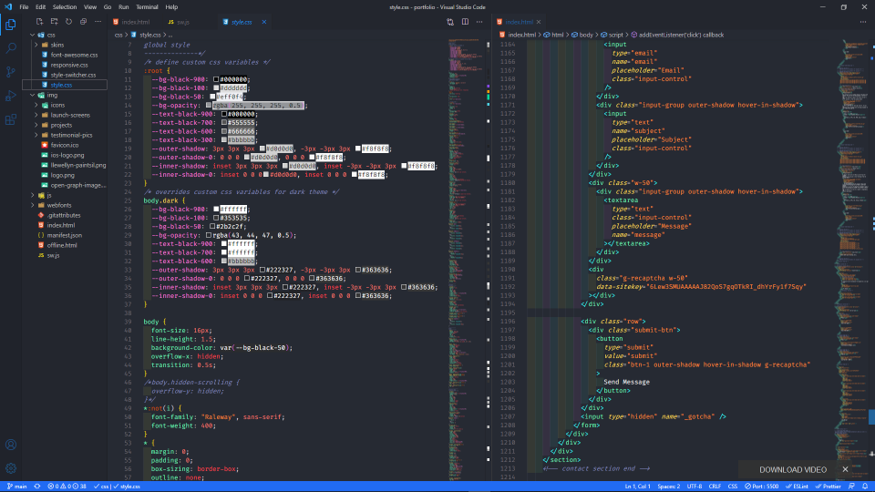
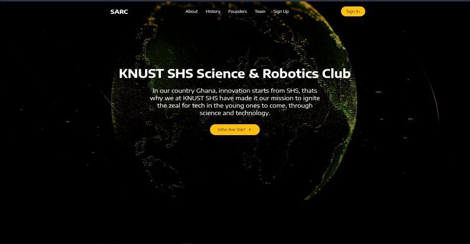
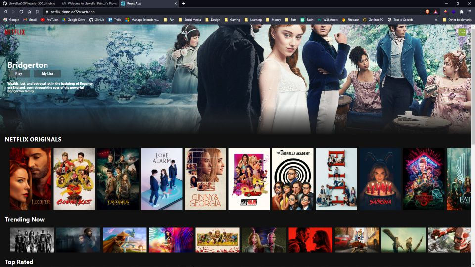
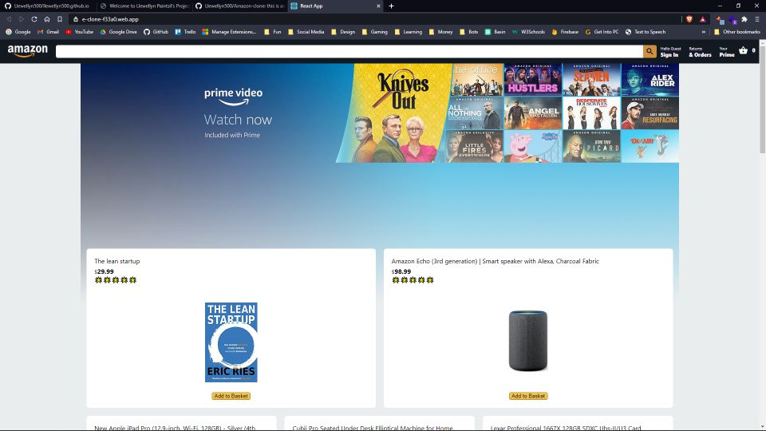

# Welcome to Llewellyn Paintsil's Projects

Here you will find links to all the projects I have worked on so far. If you are ready, look down to find them 😊.

## My Portfolio:

This is my current portfolio I am using 

**Year: 2021**

**Source Code:** [Github](https://github.com/Llewellyn500/portfolio)

**Site Link:** [Github Pages](https://llewellyn500.github.io/portfolio/)

 

## Legendar Dark VSCode Theme:

This is my very own VSCode theme I made combining Andromeda and SynthWave

**Year: 2020**

**Source Code:** [Github](https://github.com/Llewellyn500/Legendary-Dark)

**Install Link:** [Visual Studio Marketplace](https://marketplace.visualstudio.com/items?itemName=LlewellynPaintsil.legendary-dark)

 

## KNUST SHS SARC Site:

This is a site for the club I am part of, the science and robotics club of the institution KNUST SHS

**Year: 2021**

**Source Code:** [Github](https://github.com/Llewellyn500/knust-shs-sarc-site)

 

## Netflix Clone V1:

This is a site for the club I am part of, the science and robotics club of the institution KNUST SHS

**Year: 2020**

**Source Code:** [Github](https://github.com/Llewellyn500/netflix-clone)

**Site Link:** [Firebase](https://netflix-clone-de72a.web.app/)

 

## Amazon Clone:

This is a simple clone of the porpular shoping site amazon

**Year: 2020**

**Source Code:** [Github](https://github.com/Llewellyn500/Amazon-clone)

**Site Link:** [Firebase](https://e-clone-f33a0.web.app/)

 

## Glassmorphic Calculator:

This is a simple clone of the porpular shoping site amazon

**Year: 2021**

**Source Code:** [Github](https://github.com/Llewellyn500/Glassmorphic-Calculator)

**Site Link:** [Github Pages](https://llewellyn500.github.io/Glassmorphic-Calculator/)

 

## Glassmorphic Analog Clock:

This is a simple beautiful analog clock using the design concept glassmorphic

**Year: 2021**

**Source Code:** [Github](https://github.com/Llewellyn500/Glassmorphic-Analog-clock)

**Site Link:** [Github Pages](https://llewellyn500.github.io/Glassmorphic-Analog-clock/)

 

## Anime.js Background:

This is a simple beautiful animated background made using the animation library anime.js

**Year: 2021**

**Source Code:** [Github](https://github.com/Llewellyn500/Animated-Anime.js-Background)

 

This isn't the end of them, there are more to come
